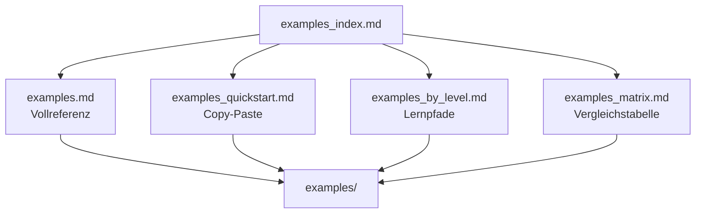

# examples_index

Diese Seite ist das zentrale Portal fuer alle Example-Dokumentationen in Nova-shell.
Sie ist dann die richtige Startseite, wenn du zwar mit den Beispielen arbeiten willst, aber noch nicht weisst, welche der vorhandenen Example-Seiten fuer dich gerade die passende ist.

Alle beschriebenen Dateien liegen unter [`examples/`](../examples/).

## Wofuer dieses Portal gedacht ist

Nutze diese Seite, wenn du:

- alle vorhandenen Example-Dokumente auf einen Blick sehen willst
- schnell entscheiden willst, ob du eine Vollreferenz, eine Copy-Paste-Seite, eine Lernpfad-Seite oder eine Vergleichsmatrix brauchst
- neue Nutzer zu einem sinnvollen Startpunkt fuehren willst
- spaeter weitere Example-Seiten zentral verlinken willst

## Die vier Example-Seiten im Ueberblick

### [`examples.md`](./examples.md)

Die dateiweise Vollreferenz.

- Wann du sie nutzen solltest:
  Wenn du wissen willst, was eine konkrete Datei in `examples/` macht.
- Staerken:
  Vollstaendige Erklaerung pro Datei, inklusive Helpern, Requests, Daten und Unterordnern.
- Beste Frage dafuer:
  "Was genau macht `examples/<datei>`?"

### [`examples_quickstart.md`](./examples_quickstart.md)

Die Copy-Paste-Schnellstartseite.

- Wann du sie nutzen solltest:
  Wenn du sofort Befehle ausfuehren willst.
- Staerken:
  Direkt nutzbare `ns.run`, `ns.graph`, `agent run`, `blob.*`, `data load` und AI-Beispiele.
- Beste Frage dafuer:
  "Welchen Befehl muss ich jetzt einfach eintippen?"

### [`examples_by_level.md`](./examples_by_level.md)

Die Lernpfad-Seite nach Erfahrungsstufe und Ziel.

- Wann du sie nutzen solltest:
  Wenn du nicht alphabetisch oder dateiweise lernen willst, sondern nach Schwierigkeitsgrad.
- Staerken:
  Sortierung nach `Einsteiger`, `Fortgeschritten`, `Plattform`, `Lifecycle`, `Agenten`.
- Beste Frage dafuer:
  "Mit welchem Beispiel sollte ich als Naechstes weitermachen?"

### [`examples_matrix.md`](./examples_matrix.md)

Die Vergleichstabelle.

- Wann du sie nutzen solltest:
  Wenn du Beispiele schnell gegeneinander abgleichen willst.
- Staerken:
  Tabellarischer Vergleich nach Kategorie, AI-Bedarf, Mesh-Bezug, Artefakten und Einstiegstauglichkeit.
- Beste Frage dafuer:
  "Welches Beispiel passt zu meinem Ziel am besten?"

## Empfohlene Einstiege

### Ich bin neu und will Nova-shell Beispiele erst einmal verstehen

1. [`examples_by_level.md`](./examples_by_level.md)
2. [`examples_quickstart.md`](./examples_quickstart.md)
3. [`examples.md`](./examples.md)

### Ich will sofort etwas laufen lassen

1. [`examples_quickstart.md`](./examples_quickstart.md)
2. [`examples_matrix.md`](./examples_matrix.md)

### Ich will die Bedeutung einer bestimmten Datei verstehen

1. [`examples.md`](./examples.md)
2. Falls noetig danach [`examples_quickstart.md`](./examples_quickstart.md)

### Ich will ein Beispiel nach Schwierigkeit oder Lernstufe waehlen

1. [`examples_by_level.md`](./examples_by_level.md)
2. Danach [`examples_quickstart.md`](./examples_quickstart.md)

### Ich will Beispiele nach Zweck vergleichen

1. [`examples_matrix.md`](./examples_matrix.md)
2. Danach [`examples.md`](./examples.md)

## Empfohlene Routen fuer typische Ziele

### Route A: Schnell sichtbares Ergebnis

1. [`examples_quickstart.md`](./examples_quickstart.md)
2. Starte `blob_runtime.ns`
3. Starte `file_extension_scan.ns`
4. Starte `file_extension_scan_advanced.ns`

### Route B: Lifecycles verstehen

1. [`examples_by_level.md`](./examples_by_level.md)
2. Lies den Bereich `Lifecycle`
3. Wechsle zu [`examples.md`](./examples.md)
4. Arbeite dann:
   - `decision_lifecycle_template.ns`
   - `CEO_ns/CEO_Lifecycle.ns`
   - `code_improvement_ns/Code_Improve_Lifecycle.ns`

### Route C: Plattform und Cluster

1. [`examples_by_level.md`](./examples_by_level.md)
2. Lies den Bereich `Plattform`
3. Vergleiche die Beispiele in [`examples_matrix.md`](./examples_matrix.md)
4. Nutze danach `ns.graph` aus [`examples_quickstart.md`](./examples_quickstart.md)

### Route D: Agenten praktisch einsetzen

1. [`examples_by_level.md`](./examples_by_level.md)
2. Bereich `Agenten`
3. Danach [`examples_quickstart.md`](./examples_quickstart.md)
4. Nutze einzelne Rollen in `CEO_ns/` oder die grossen Agentenbundles

## Wie die Example-Dokumentation zusammenhaengt

## Was du hier nicht findest

Dieses Portal ersetzt nicht die Vollreferenz. Es ist bewusst kompakter als [`examples.md`](./examples.md).
Wenn du Detailfragen zu einer konkreten Datei, einem Request, einem Helper oder einem Unterordner hast, gehe von hier aus immer in die dateiweise Referenz.

## Pflegehinweis

Wenn neue Dateien unter `examples/` dazukommen, sollten idealerweise diese Seiten gemeinsam gepflegt werden:

1. [`examples.md`](./examples.md)
2. [`examples_quickstart.md`](./examples_quickstart.md)
3. [`examples_by_level.md`](./examples_by_level.md)
4. [`examples_matrix.md`](./examples_matrix.md)
5. [`examples_index.md`](./examples_index.md)

So bleibt die Dokumentation konsistent:

- `examples.md`
  beschreibt die Datei fachlich
- `examples_quickstart.md`
  liefert Startbefehle
- `examples_by_level.md`
  ordnet sie didaktisch ein
- `examples_matrix.md`
  ordnet sie vergleichend ein
- `examples_index.md`
  bleibt das zentrale Portal
